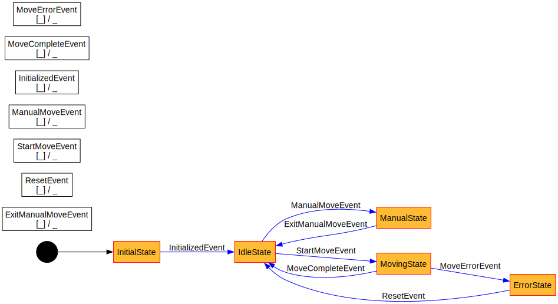

# Pilot PLC Demo Project

## Quickstart

Run 
```
pilot fw update
pilot fw build
pilot fw program --host [raspberrypi]
```

`pilot fw update` only needs to be run once after cloning the repository.

## Structure


## State Machine

This project uses [smlang](https://github.com/korken89/smlang-rs), and has the [graphviz](https://graphviz.org/) feature enabled.
That means, when you compile this project using `pilot fw build` a graph of your state-machine is generated named `statemachine.svg` looking like this:



You need to have graphviz installed for that to work (`apt install graphviz`).
If you don't want to use this feature, remove the `graphviz` feature in `smlang` in `Cargo.toml`

## Error handling
